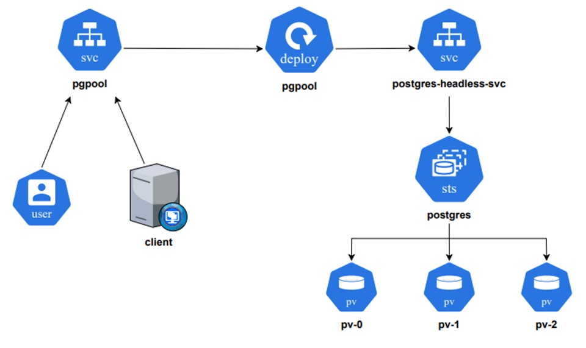

# Déployer Postgresql sur Kubernetes avec Haute Disponibilité

## Architecture de Haut Niveau

## Créer un espace de noms

kubectl create namespace database

## Création des PV en local-storage

kubectl apply -f pv-localstorage.yaml

## Création des Composants du serveur Postgres:
- ConfigMaps 
- Service Sans Tête 
- Secrets 
- StatefulSet 

kubectl apply -f ./postgresql -n database

## Composants du Pg-Pool pour Postgres:
- Secrets
- Services: ClusterIP & NodePort
- Déploiements

kubectl apply -f ./pgpool -n database

## Connectez-vous au cluster PostgreSQL à partir du client

kubectl apply -f ./client -n database

kubectl get secret postgres-secrets -n database -o jsonpath="{.data.postgresql-password}" | base64 --decode

kubectl exec -it pg-client -n database -- /bin/bash

PGPASSWORD=eazytraining2024 psql -h pgpool-svc -p 5432 -U postgres

PGPASSWORD=eazytraining2024 psql -h <IP ADDR> -p <NODEPORT ADDR of pgpool-svc-nodeport> -U postgres

create database db_test; 

\c db_test; //pour se connecter à une nouvelle base de données

create table test_table (id int primary key not null, value text not null);         
                
insert into test_table values (1, 'value1');      
insert into test_table values (2, 'value2');      
insert into test_table values (3, 'value3');      

select * from test_table;

//after connecting to the cluster using psql client;

select * from pg_stat_replication;

